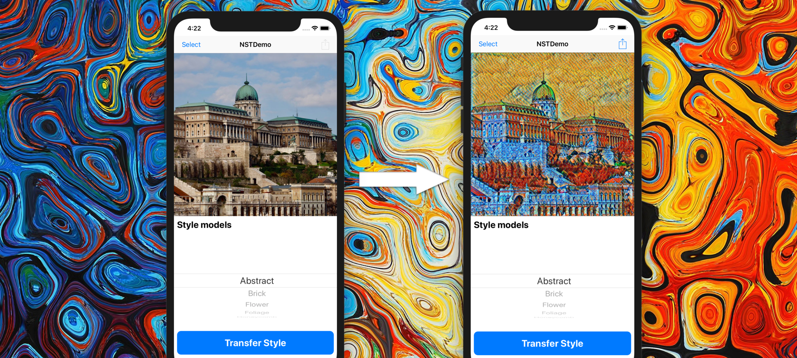
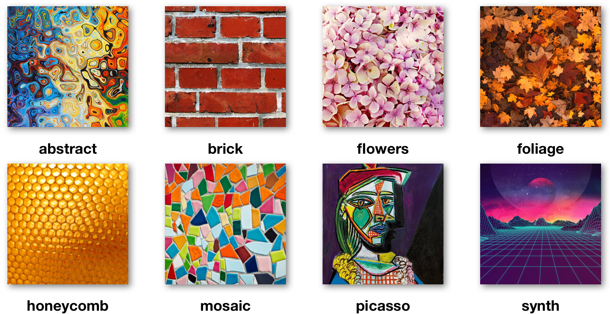
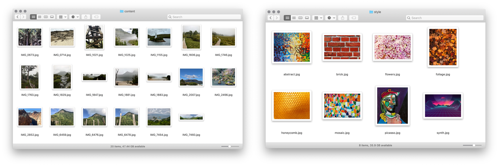
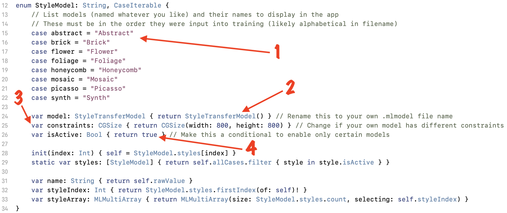
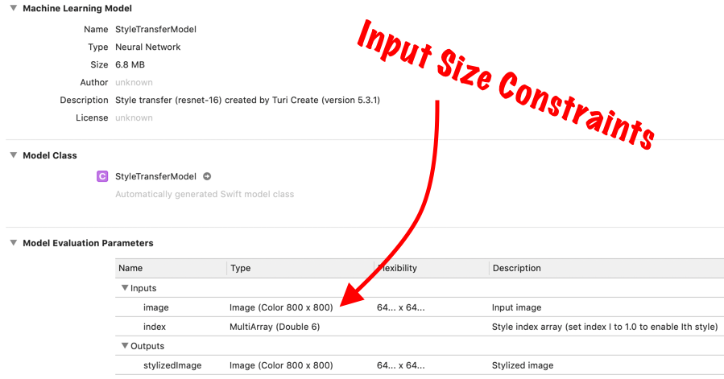

# Other Image Tasks
Code includes starting point and complete code for **NSTDemo**  application. This project is a quick and easy way to get started experimenting with TuriCreate and CoreML, with visual output that is fun to test.

## Using NSTDemo

The structure of the app is very simple. There is an **AppDelegate.swift** file that is nothing more that what is required, and there is a **ViewController.swift** file with a corresponding **Main.storyboard** that controls a single view and its elements: 

* a `UIBarButton` that summons an `UIImagePickerView` to select from Photos
* a `UIImageView` to display the image chosen
* a `UIPickerView` to select the model to apply
* a `UIButton` to apply the model and show the output in the `UIImageView`
* a `UIBarButton` that summons a `UIActivityView` to share the created image
* an optional `UIAlertView` that is displayed if the image selected is too small for the model to transform, or something else goes wrong in the transform process

There is a **StyleTransferModel.mlmodel** file that was trained for a quick demonstration. It features eight styles trained on style images with distinct colours and textures (see below), but was only trained with 6000 iterations and given very limited content images. This should be replaced with something trained for longer and with more diverse training content if output quality is to be improved.

There are also three additional Swift files. **Image.swift** contains `UIImage` extensions for cropping, resizing, and creating `CVPixelBuffer` from a given image. This file also includes a function `styled(with modelSelection: StyleModel) -> UIImage` that will return a copy of the image it is called on, styled with the model and options provided.

**StyleModel.swift** is the file provided the enumeration passed to the `styled(with:)` function. Its cases correspond to the styles the .mlmodel file was trained with. **Utils.swift** just contains a few general-purpose extensions to make code nicer to read and write, including functions for `MLMultiArray`, `CVPixelBuffer` and `CGContext` types.

### Creating a new MLModel

Once you've got [TuriCreate](https://github.com/apple/turicreate) up and running, ideally inside a virtualenv (refer to [Turi's installation guide](https://github.com/apple/turicreate#supported-platforms) for info), activate the virtualenv and make three folders inside it:

* **content** — place a collection of images of the type you'd like the style transfer to work on in here (ideally lots of images representing a vast range of content: people, animals, landscapes, objects, everything)
* **style** – place as many different style images as you'd like to be able to transfer in here (the images you want your created images to imitate the style of)
* **test** – place a collection of images of the same type as the content images in here, so you can potentially evaluate your style transfer model for effectiveness (like the first category but needs less images, content doesn't really matter but will benefit from being varied)

At the same level as the folders, add the **train_nst.py** script, and execute it using the command `python train_nst.py`.

Now, sit back and wait for your computer to train a model. Depending on how many styles you ask it to train, and how many content images you provide, this could take upwards of 2 days!

### Modifying code

In the **StyleModel.swift** file, there is the declaration of an enum called **StyleModel**. It looks as follows:

If a new .mlmodel file has been trained to replace the old one, some changes may need to be made.

1. the **enum cases** should list all model style options in the order they were input into training (this will often be alphabetical by image filename): the case name can be anything, the String rawValue should be how you want it listed in the app
2. the **model** variable type and return value must match the name of your .mlmodel file
3. the **constraints** for input size must match those listed in the .mlmodel details (see below)
4. the **isActive** variable return value can be replaced with conditional statements to omit styles from being visible and accessible in the app (in case you decide you don't like all styles you trained on, you can still use the same .mlmodel)

And that's it! Go forth and transform!

## License

**NSTDemo** is available under the [MIT](https://opensource.org/licenses/MIT) license. See the LICENSE file for more info.

All images used in the creation of models included are [Public Domain](https://creativecommons.org/share-your-work/public-domain/) or from Pixabay (either [CC0](https://creativecommons.org/share-your-work/public-domain/cc0/) or under the [Pixabay License](https://pixabay.com/service/license/)). 

Images featured/style-transferred in screenshots are of--and belong to--the repository authors.